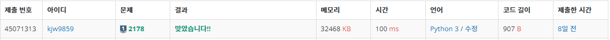

# Week1

## DFS와 BFS([https://www.acmicpc.net/problem/1260](https://www.acmicpc.net/problem/1260))

### 1. 문제 요약

- 주어진 노드 간의 정보를 이용해 DFS, BFS로 완전 탐색하는 문제

### 2. 푸는 과정

```
1) 주어진 정보는 양방향이므로 양노드 list에 append 저장
2) 정점 번호가 작은 것을 방문한다는 조건이 있으므로 각 list.sort()
3) 재귀 구조를 이용해 DFS기반 완전 탐색(방문 시 check[index] = true)
4) 큐를 이용한 BFS기반 완전 탐색(방문 시 check[index] = true)
```

### 3. 총평 및 주의 사항

```
DFS, BFS 기본 탐색 원리를 알고 있으면 쉽게 풀 수 있었음.
```

### 4. 결과

> 정답여부 : 정답,    소요 시간: 17분, cpp : 20분
> 


---

## 미로탐색([https://www.acmicpc.net/problem/2178](https://www.acmicpc.net/problem/2178))

### 1. 문제 요약

- 주어진 2차원 배열에서 시작점에서 목적지까지 BFS로 최소 거리 탐색문제

### 2. 푸는 과정

```
1) 맵 정보를 2차원 list에 저장
2) BFS 탐색으로 방문하지 않은 갈 수 있는 길을 Queue 구조에 추가
3) 방문 정보는 해당 위치에 방문하기 전의 무게값 + 1 로 설정
4) 2차원 list의 끝 인덱스에 도착하면 무게값 return
```

### 3. 총평 및 주의 사항

```
BFS 기반 탐색으로 무게값을 전 위치의 무게값 +1 로 설정하여 거리 탐색
```

### 4. 결과

> 정답여부 : 정답, 소요시간 11분, cpp : 23
> 



---
