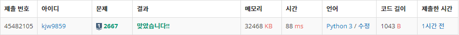
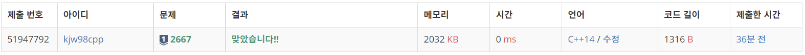
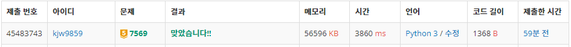
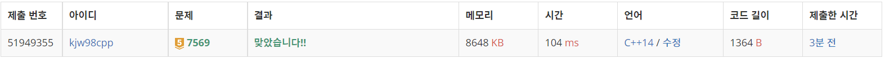

# Week2

## 단지번호 붙이기([https://www.acmicpc.net/problem/2667](https://www.acmicpc.net/problem/2667))

### 1. 문제 요약

- 주어진 지도의 정보를 이용해 BFS로 완전 탐색하는 문제

### 2. 푸는 과정

```
1) 주어진 Map 정보를 2차원 리스트에 저장
2) 전체 맵을 완전탐색하여 집이 있는 위치를 발견했을 시 BFS 실행
3) BFS 기반 완전 탐색하고 BFS 구조 종료시 단지 저장
4) 맵 탐색을 이어하고 방문하지 않은 집을 발견했을 시 BFS 실행
5) 단지를 저장한 리스트를 정렬하여 조건에 맞게 출력
```

### 3. 총평 및 주의 사항

```
BFS 기본 탐색 원리와 정렬 함수를 알고 있다면 빠르게 풀 수 있다.
```

### 4. 결과

> 정답여부 : 정답,    소요 시간: 10분, cpp : 13분
> 




---

## 토마토([https://www.acmicpc.net/problem/7569](https://www.acmicpc.net/problem/7569))

### 1. 문제 요약

- 주어진 3차원 배열에서 BFS로 방문 시간 탐색문제

### 2. 푸는 과정

```
1) 맵 정보를 3차원 리스트에 저장
2) 맵을 완전탐색하여 익지 않은 토마토 개수 세고, 익은 토마토 큐 구조에 넣기
3) 익지 않은 토마토가 있다면 BFS 기반 완전 탐색 실행 방문 정보는 걸린 시간
4) 익지 않은 토마토가 없어지면 마지막에 걸린 시간 출력 있다면 -1 출력
```

### 3. 총평 및 주의 사항

```
BFS 기반 탐색으로 무게값을 전 위치의 무게값 +1 로 설정하여 거리 탐색, 이동할 수 있는 좌표는 위, 아래 오른쪽, 왼쪽, 앞, 뒤 6 방향
```

### 4. 결과

> 정답여부 : 정답, 소요시간 16분, cpp : 30분
> 



---
