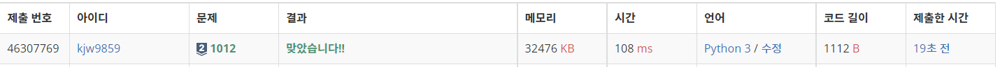

# Week4

## 상범 빌딩([https://www.acmicpc.net/problem/6593](https://www.acmicpc.net/problem/6593))

### 1. 문제 요약

- 주어진 입력의 형태로 맵 정보를 저장하고, BFS로 최소 거리를 탐색하는 문제

### 2. 푸는 과정

```
1) 0, 0, 0을 입력 받게되면 종료하는 플래그 생성
2) 받아진 'L', 'R' 값으로 반복하여 Map 정보 저장 'S' 좌표를 처음 Que에 넣어준다.
3) BFS 기반 완전 탐색하고 check + 1 형태로 거리 재기
4) 'E'구간 도착 시 check E 좌표 출력
```

### 3. 총평 및 주의 사항

```
BFS 기반 탐색으로 무게값을 전 위치의 무게값 +1 로 설정하여 거리 탐색, 주어진 입력의 형태로 맵 정보를 저장할 수 있다면 풀 수 있다.
```

### 4. 결과

> 정답여부 : 정답,    소요 시간: 20분, cpp : 20분
> 


---

## 유기농 배추([https://www.acmicpc.net/problem/1012](https://www.acmicpc.net/problem/1012))

### 1. 문제 요약

- 주어진 3차원 배열에서 BFS로 방문 시간 탐색문제

### 2. 푸는 과정

```
1) 주어진 입력으로 빈 공간의 맵 데이터 생성
2) 배추 개수 만큼 반복하여 주어진 좌표에 배추 심기
3) 배추를 다 심었으면 BFS 기반 완전 탐색으로 이어져 있는 구간 탐색
4) 구간이 끊어지면 count + 1 해주고 다시 BFS 기반 완전 탐색
```

### 3. 총평 및 주의 사항

```
BFS기반 완전탐색, BFS Que가 비어지면 다시 새로운 배추 구간 탐색하여 재탐색
```

### 4. 결과

> 정답여부 : 정답, 소요시간 10분, cpp : 10분
> 




---
