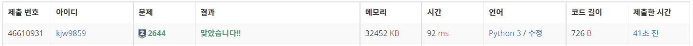
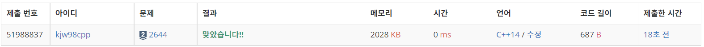
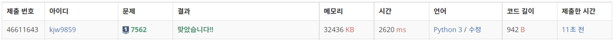
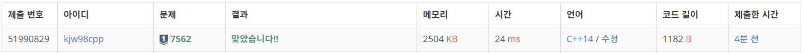

# Week5

## 촌수 계산([https://www.acmicpc.net/problem/2644](https://www.acmicpc.net/problem/2644))

### 1. 문제 요약

- BFS로 최소 거리를 탐색하는 문제

### 2. 푸는 과정

```
1) 양방향으로 이동 할 수 있는 그래프 생성
2) 입력으로 받은 두 사람의 노드 번호 중 하나를 deque에 넣어 거리를 탐색한다.
3) BFS 기반 저장된 노드를 완전 탐색하고 check + 1 형태로 거리 재기
4) 나머지 하나에 도달하면 거리 출력, 도달하지 못하면 -1 출력
```

### 3. 총평 및 주의 사항

```
BFS 기반 탐색으로 무게값을 전 위치의 무게값 +1 로 설정하여 거리 탐색
```

### 4. 결과

> 정답여부 : 정답,    소요 시간: 8분, cpp : 10분
> 




---

## 나이트의 이동([https://www.acmicpc.net/problem/7562](https://www.acmicpc.net/problem/7562))

### 1. 문제 요약

- 나이트의 이동 규칙에 따라 BFS로 방문 시간 탐색문제

### 2. 푸는 과정

```
1) 주어진 입력만큼 비어있는 방문 데이터 생성
2) 처음 시작좌표에서 나이트의 이동 규칙에 따른 BFS 완전 탐색
3) 골 좌표에 도달하면 방문 시간 출력
```

### 3. 총평 및 주의 사항

```
나이트의 이동 규칙을 미리 저장하여 BFS 탐색
```

### 4. 결과

> 정답여부 : 정답, 소요시간 9분 cpp : 50분 == -> && 오타로 인한 디버깅
> 



