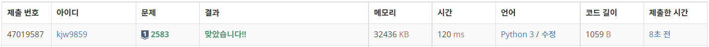
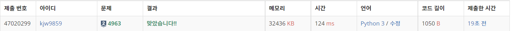
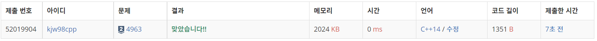

# Week6

## 영역 구하기([https://www.acmicpc.net/problem/2583](https://www.acmicpc.net/problem/2583))

### 1. 문제 요약

- 몇 번의 BFS 탐색으로 빈 곳 전체를 방문 할 수 있는지 확인하는 문제

### 2. 푸는 과정

```
1) 주어진 입력으로 빈 맵 생성
2) 여러개의 사각형 입력을 받아 사각형이 닿는 면적에 벽 생성하기
3) 전체 맵을 확인하여 벽 없는 지역에서 BFS 기반 완전 탐색하고 방문 체크하기
4) BFS 사이클 수, 각 BFS로 방문한 지역 개수 출력
```

### 3. 총평 및 주의 사항

```
입력받은 사각형 좌표 정보로 벽 잘 세우기 
```

### 4. 결과

> 정답 여부 : 정답,    소요 시간: 15분, cpp : 12분
> 




---

## 섬의 개수([https://www.acmicpc.net/problem/4963](https://www.acmicpc.net/problem/4963))

### 1. 문제 요약

- 몇 번의 BFS 탐색으로 섬 전체를 방문 할 수 있는지 확인하는 문제

### 2. 푸는 과정

```
1) 주어진 입력으로 빈 맵 생성
2) 맵 정보 저장하기
3) 전체 맵을 확인하여 방문한 적 없는 섬을 중심으로 BFS 탐색하기
4) BFS 사이클 수 출력
```

### 3. 총평 및 주의 사항

```
몇 번의 BFS 탐색으로 완전 탐색 가능한지 확인하기
```

### 4. 결과

> 정답 여부 : 정답, 소요 시간: 8분, cpp : 12분
> 



