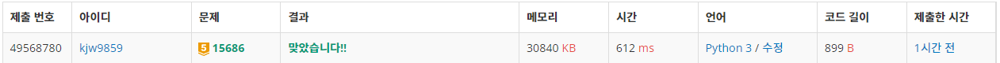
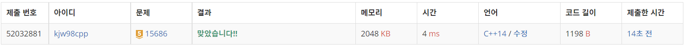

# Week8

## 치킨 배달([https://www.acmicpc.net/problem/15686](https://www.acmicpc.net/problem/15686))

### 1. 문제 요약

- 조합을 이용하여 브루트포스, 가장 짧은 거리의 값 찾기

### 2. 푸는 과정

```
1) 조건에 맞게 M개의 치킨집 조합 선택
2) 조합이 구해지면 구한 조합으로 각각의 집 까지의 가장 짧은 거리 계산
3) 모든 집까지의 거리의 합과 가장 짧은 치킨거리 비교 후 저장
4) 반복하여 가장 짧은 치킨 거리 출력
```

### 3. 총평 및 주의 사항

```
1. 재귀함수를 이용해 조합을 구하여 구현하였으며, 삼성 코테의 경우 itertools를 사용할 수 없다고 하니 순열, 조합 만드는 코드 직접 작성해보기
```

### 4. 결과

> 정답 여부 : 정답,    소요 시간: 35분, cpp : 20분
> 




---
