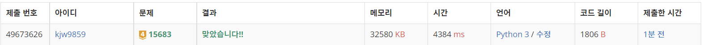
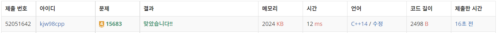

# Week9

## 감시([https://www.acmicpc.net/problem/15683](https://www.acmicpc.net/problem/15683))

### 1. 문제 요약

- 조합을 이용하여 브루트포스, 사각지대가 가장 적은 방향 배치 찾기

### 2. 푸는 과정

```
1) CCTV 종류에 맞게 방향이 중복되지 않도록 조합 만들기
2) 조합이 구해지면 구한 조합으로 CCTV로 관찰되는 지역 체크하기
3) 모든 CCTV의 관찰 구역 체크하기
4) 반복하여 사각지대가 가장 작은 값 찾기
```

### 3. 총평 및 주의 사항

```
1. 조합을 만들때 중복되는 방향에 대해서 백트래킹하면 시간을 많이 줄일 수 있을 것 같다
2. 지역을 체크할 때 BFS와 다르게 방문 지역을 넘어서 관찰되지 않았던 구역이 있을 수 있으므로 이어서 방문하기
```

### 4. 결과

> 정답 여부 : 정답,    소요 시간: 55분, cpp : 60분
> 




---
