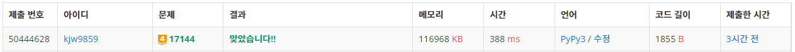
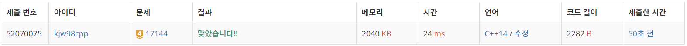

# Week11

## 미세먼지 안녕!([https://www.acmicpc.net/problem/17144](https://www.acmicpc.net/problem/17144))

### 1. 문제 요약

- 문제를 읽고 차례대로 구현하여 푸는 문제

### 2. 푸는 과정

```
1) 지도를 입력 받고 공기청정기 위치 저장
2) 미세먼지 확산 구현, 확산 디버깅하기
3) 공기청정기 작동 구현, 작동 디버깅하기
```

### 3. 총평 및 주의 사항

```
1. 주어진 구현 순서를 맞춰 구현하고, 각 부분이 끝났을 때 디버깅하여 오류 지점 빠르게 파악하기
```

### 4. 결과

> 정답 여부 : 정답,    소요 시간: 45분, cpp : 60분
> 




---
