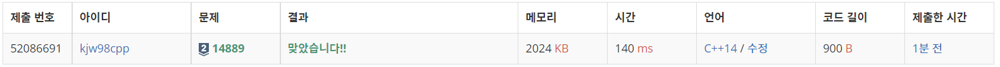

# Week12

## 스타트와 링크([https://www.acmicpc.net/problem/14889](https://www.acmicpc.net/problem/14889))

### 1. 문제 요약

- 브루트포스로 팀을 구성하고 팀의 능력치 차이가 최소가 되는 능력치 차이의 최소값 구하기

### 2. 푸는 과정

```
1) DFS를 이용하여 팀을 구성
2) 두 팀의 능력치 차이를 계산하여 차이의 최소값 구하기
```

### 3. 총평 및 주의 사항

```
1. DFS의 팀 결정 조건이 모인 사람 수를 넘어가는 조건보다 앞에 있도록 하기
```

### 4. 결과

> 정답 여부 : 정답,    소요 시간: 20분, cpp : 15분
> 



---
