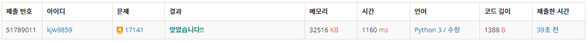
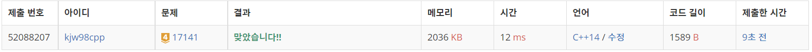

# Week13

## 연구소2([https://www.acmicpc.net/problem/17141](https://www.acmicpc.net/problem/17141))

### 1. 문제 요약

- 브루트포스, BFS 문제

### 2. 푸는 과정

```
1) 맵 입력 받고 바이러스 후보 위치, 빈칸 개수 저장
2) 바이러스 조합 만들어 BFS 동작
3) 동작 결과 시간 값 비교하여 최저시간 저장
4) 최저시간이 초기값이면 -1 출력 아니면 최저시간 출력
```

### 3. 총평 및 주의 사항

```
1. 바이러스 후보지역에서 바이러스를 놓지 않았다면 빈칸으로 취급하기
```

### 4. 결과

> 정답 여부 : 정답,    소요 시간: 23분, cpp : 20분
> 



---
