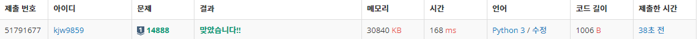
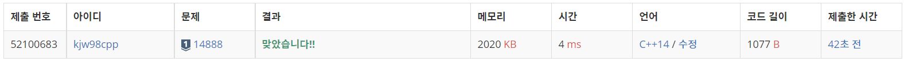

# Week14

## 연산자끼워넣기([https://www.acmicpc.net/problem/14888](https://www.acmicpc.net/problem/14888))

### 1. 문제 요약

- 중복된 수가 있는 특수한 순열

### 2. 푸는 과정

```
1) DFS 이용하여 가능한 모든 순열 구하기
2) 계산하여 max, min 값 갱신
3) max, min 출력
```

### 3. 총평 및 주의 사항

```
1. cal 함수를 이용하여 계산할 때 배열을 바꿔가면서 계산하지 않고 값을 가져가면서 계산하기

-> 배열값을 copy 해서 계산할 경우 문제 발생 (얕은 복사되어 초기 배열 값이 달라짐)
```

### 4. 결과

> 정답 여부 : 정답,    소요 시간: 45분, cpp : 14분
> 



---
