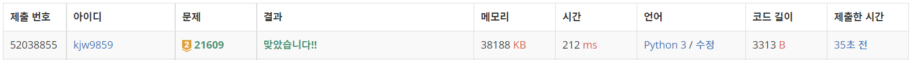
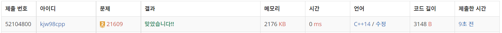

# Week15

## 상어중학교([https://www.acmicpc.net/problem/21609](https://www.acmicpc.net/problem/21609))

### 1. 문제 요약

- 구현, BFS 문제

### 2. 푸는 과정

```
1) 반복되는 과정 순서대로 구현

2) 블록 찾기 - 색깔별로 check 할 수 있도록 맵의 크기 + 색깔의 크기를 갖는 리스트 생성
2-2) 해당 색깔로 탐색한 결과가 없다면 탐색
2-3) 우선순위 큐를 이용하여 문제의 조건대로 블록 크기, 무지개 블록, 기준블록 저장

3) 중력 작용 - 행 번호가 큰 것부터 작은 순으로 검사
3-2) 검사하다가 검은 블록이 나오면 저장된 블록 방출 -> 빈 칸은 저장하지 않음

4) 90도 반시계 회전 - 적절한 위치에 기존 맵 입력
```

### 3. 총평 및 주의 사항

```
1. 문제 잘 읽고, 주어진 조건 확실하게 확인하기
```

```
cpp
1. 벡터값이 필요 없어지는 순간 비우는 습관 들이기
2. sort 세번째 인자 함수 만드는 연습하기
```

### 4. 결과

> 정답 여부 : 정답,    소요 시간: 180분, cpp : 110분
> 



---
