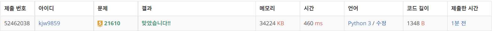
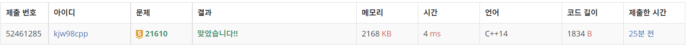

# Week17

## 마법사 상어와 비바라기([https://www.acmicpc.net/problem/21610](https://www.acmicpc.net/problem/21610))

### 1. 문제 요약

- 구현

### 2. 푸는 과정

```
1) 이동 -> 1번 행과 N번 행, 1번 열과 N번 열이 이어져 있으므로 한 칸씩 움직이지 않고 한번에 이동되는 좌표를 계산하여 입력

2) 물복사, 구름 생성 - 구름을 이동시키고 소멸시키는 과정에서 해당 좌표 저장, 좌표에서 조건에 맞으면 물복사, 구름 생성 수행
```

### 3. 총평 및 주의 사항

```
시키는 순서대로 구현
```

### 4. 결과

문제 풀이 순서 CPP → python

> 정답 여부 : 정답,    소요 시간 python: 25분, cpp : 35분
> 





---
