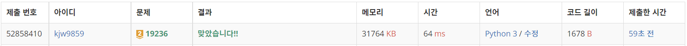
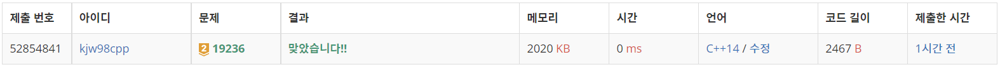

# Week18

## 청소년 상어([https://www.acmicpc.net/problem/19236](https://www.acmicpc.net/problem/19236))

### 1. 문제 요약

- 구현

### 2. 푸는 과정

```
1) dfs 구조로 물고기를 움직이기 전 맵, 물고기 정보를 저장해놓고 dfs 마지막에 다시 초기 상태로 돌려 다른 탐색에 영향을 주지 않도록 구현

2) 물고기 이동 : 1번 물고기부터 16번 물고기 순서대로 이동, 이동할 수 있을 때 현재 좌표와 다음 좌표 정보 스왑

3) 상어 이동 : 상어가 방향에서 움직일 수 있는 범위는 1 ~ 3 이므로 해당 칸을 움직였을 때 물고기가 있다면 움직이고 dfs 구조로 다시 들어감
-> dfs 구조가 끝나면 다시 점수와, 물고기를 먹기 전 상태로 되돌림
```

### 3. 총평 및 주의 사항

```
시키는 순서대로 구현
```

### 4. 결과

문제 풀이 순서 CPP → python

> 정답 여부 : 정답,    소요 시간 python: 50분, cpp : 75분
> 





---
